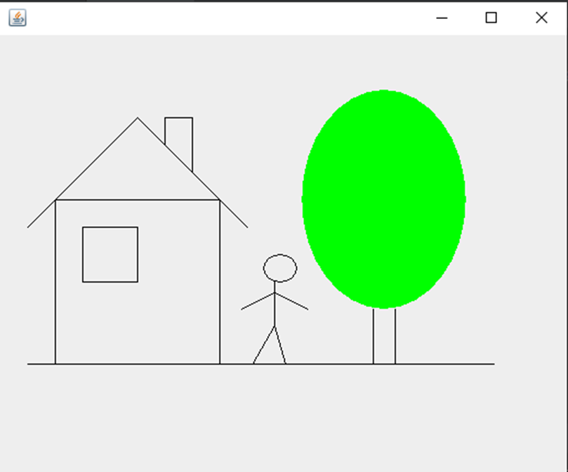

Лабораторная работа 16. Работа с 2D - графикой

Цель: изучение класс Graphics (java.awt.Graphics)

Задание для практического выполнения:

Напишите программу, рисующую картинку (без осей координат и координатной решетки)

